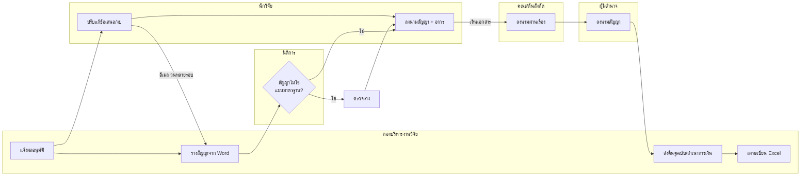
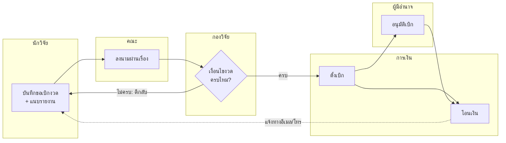
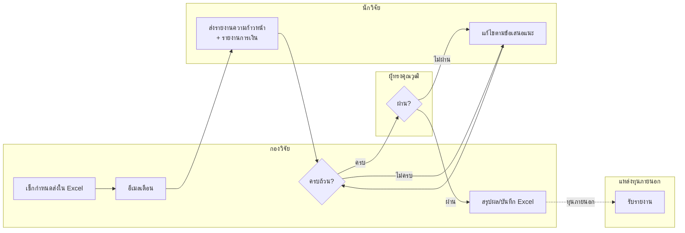
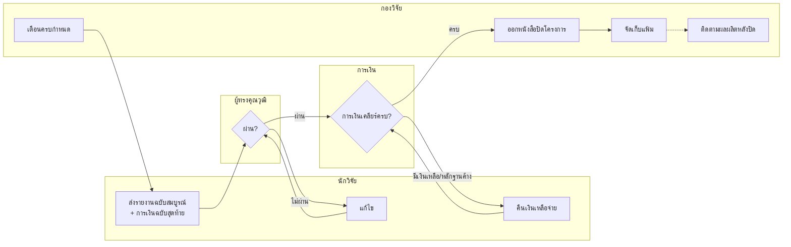

# 01 — กระบวนการปัจจุบัน (As-is): บริหารเงินทุนวิจัยหลังอนุมัติทุน

> **สถานะเอกสาร:** ร่างเพื่อยืนยัน
> **ขอบเขต:** ทำสัญญา → เบิกจ่าย → ติดตามความก้าวหน้า → ปิดโครงการ
> **Input:** โครงการที่ได้รับอนุมัติทุนแล้ว (ทั้งทุนภายในมหาวิทยาลัยและทุนภายนอก)

## ผลการยืนยันจากผู้ใช้ (รอบที่ 1)

| รายการ | ผล |
|---|---|
| [A1] ทุกเรื่องต้องผ่านคณะ/ต้นสังกัด | ✅ ใช่ ทุกเรื่อง |
| [A7] ระบบต้องครอบคลุมการใช้จ่ายภายในโครงการ | ✅ ใช่ (จัดซื้อ ยืมเงิน ล้างหนี้) |
| ระบบการเงินเดิม | ✅ SAP ECC 6.0 และกำลังอัปเกรดเป็น SAP S/4HANA |
| [A5] แหล่งทุนภายนอกหลัก | ⏳ มีหลายแหล่ง แต่ยังระบุไม่ได้ ระบบต้องรองรับแหล่งทุนใหม่ได้โดยไม่ต้องแก้โค้ด |
| ข้ออื่น (A2–A4, A6, A8–A11) | 🟡 ยังเป็นสมมติฐาน |

## วิธีอ่านเอกสาร

| สัญลักษณ์ | ความหมาย |
|---|---|
| ✅ **ข้อเท็จจริง** | ได้จากข้อมูลที่ผู้ใช้ให้มา ได้แก่ ระดับมหาวิทยาลัย, ทำงานด้วยกระดาษ/อีเมล, ขอบเขต 4 ช่วง |
| 🟡 **[A#] สมมติฐาน** | แนวปฏิบัติที่พบบ่อยในมหาวิทยาลัยรัฐของไทย **ต้องยืนยันกับหน่วยงานจริง** |
| 🔴 **[P#] ปัญหา/คอขวด** | จุดที่ทำให้ช้า ผิดพลาด หรือมีความเสี่ยง (ใช้เป็น input ของข้อ 2: To-be) |

### ผู้เกี่ยวข้อง (Actors)

| รหัส | บทบาท | หน้าที่หลักในกระบวนการ |
|---|---|---|
| PI | นักวิจัย / หัวหน้าโครงการ | ลงนามสัญญา ขอเบิก ใช้จ่าย ส่งรายงาน |
| FAC | หน่วยวิจัยระดับคณะ / หัวหน้าส่วนงาน | ตรวจกลั่นกรองและลงนามผ่านเรื่อง ✅ [A1] |
| RO | กองบริหารงานวิจัย (เจ้าหน้าที่) | ทำสัญญา ตรวจเงื่อนไข ติดตาม และปิดโครงการ |
| LEG | งานนิติการ | ตรวจร่างสัญญาที่ไม่ใช่แบบมาตรฐาน 🟡 [A2] |
| FIN | กองคลัง / การเงิน / พัสดุ | ตั้งเบิก จ่ายเงิน ตรวจหลักฐาน รับคืนเงิน |
| AUTH | ผู้มีอำนาจอนุมัติ (เช่น รองอธิการบดีฝ่ายวิจัย) | ลงนามสัญญาและอนุมัติเบิกจ่าย |
| REV | ผู้ทรงคุณวุฒิ | ประเมินรายงานความก้าวหน้าและรายงานฉบับสมบูรณ์ 🟡 [A3] |
| EXT | แหล่งทุนภายนอก | ทำสัญญา โอนเงินงวด รับรายงาน (เฉพาะทุนภายนอก) |

---

## ช่วงที่ 1: การทำสัญญารับทุน

### ขั้นตอน

| # | ขั้นตอน | ผู้ทำ | เอกสาร/ช่องทาง | หมายเหตุ |
|---|---|---|---|---|
| 1.1 | แจ้งผลอนุมัติทุนให้นักวิจัย | RO | หนังสือแจ้ง / อีเมล | |
| 1.2 | นักวิจัยปรับแก้ข้อเสนอ แผนงาน และงบประมาณตามข้อเสนอแนะของกรรมการ | PI | ไฟล์ Word ส่งทางอีเมล | 🟡 [A4] บางทุนเท่านั้น · 🔴 [P1] ส่งกลับไปมาหลายรอบ |
| 1.3 | จัดทำร่างสัญญาจาก template และกรอกข้อมูลโครงการ งบ และงวดเงิน | RO | Word template | 🔴 [P2] พิมพ์ข้อมูลซ้ำที่มีอยู่แล้ว เสี่ยงพิมพ์ผิด |
| 1.4 | ตรวจร่างสัญญา (กรณีไม่ใช่แบบมาตรฐาน หรือเป็นสัญญาทุนภายนอก) | LEG | บันทึกข้อความ | 🟡 [A2] |
| 1.5 | พิมพ์สัญญา 2 ฉบับ ส่งให้นักวิจัยลงนาม และติดอากรแสตมป์ | RO → PI | กระดาษ | 🔴 [P3] ต้องเดินเอกสารหรือส่งไปรษณีย์ |
| 1.6 | ส่งเรื่องผ่านหน่วยงานต้นสังกัด | PI → FAC | บันทึกข้อความ | ✅ [A1] · 🔴 [P4] ค้างที่โต๊ะ ไม่รู้สถานะ |
| 1.7 | ผู้มีอำนาจลงนามในสัญญา | AUTH | กระดาษ | 🔴 [P5] รอคิวเกษียณหนังสือ |
| 1.8 | ส่งคู่ฉบับคืนนักวิจัย และส่งสำเนาให้การเงิน | RO | สำเนากระดาษ / สแกน | |
| 1.9 | ลงทะเบียนโครงการใน Excel ของกอง | RO | Excel | 🔴 [P6] ข้อมูลอยู่หลายไฟล์ ไม่มี single source of truth |
| 1.10 | *(ทุนภายนอก)* ลงนามสัญญากับแหล่งทุน และรอเงินงวดแรกเข้าบัญชีมหาวิทยาลัย | RO, AUTH, EXT | ระบบของแหล่งทุน / กระดาษ | 🟡 [A5] บางแหล่งทุนใช้ระบบออนไลน์ของตนเอง (เช่น NRIIS) |

### Diagram

---

## ช่วงที่ 2: การแบ่งงวดเงินและการเบิกจ่าย

### 2A. การขอรับเงินงวด (จากมหาวิทยาลัยเข้าโครงการ)

| # | ขั้นตอน | ผู้ทำ | เอกสาร/ช่องทาง | หมายเหตุ |
|---|---|---|---|---|
| 2.1 | ทำบันทึกข้อความขอเบิกเงินงวด | PI | บันทึกข้อความ (กระดาษ) | |
| 2.2 | แนบเงื่อนไขของงวด เช่น รายงานความก้าวหน้า หรือรายงานการเงินงวดก่อน (งวด 2 ขึ้นไป) | PI | เล่มรายงาน / PDF | 🔴 [P7] แนบไม่ครบ ถูกตีกลับ |
| 2.3 | ลงนามผ่านเรื่อง | FAC | กระดาษ | ✅ [A1] |
| 2.4 | ตรวจเงื่อนไขงวด (ส่งรายงานแล้วหรือยัง ยอดตรงสัญญาหรือไม่ ผ่านการประเมินหรือไม่) | RO | เปิดดู Excel + แฟ้มเอกสาร | 🔴 [P8] ตรวจด้วยมือ ต้องค้นแฟ้ม |
| 2.5 | ส่งเรื่องให้การเงินตั้งเบิก | RO → FIN | บันทึกข้อความ | |
| 2.6 | อนุมัติเบิกจ่าย | AUTH | กระดาษ | 🔴 [P5] |
| 2.7 | โอนเงินเข้าบัญชีโครงการหรือบัญชีนักวิจัย | FIN | SAP ECC 6.0 | 🟡 [A6] รูปแบบบัญชีแตกต่างกันในแต่ละแห่ง |
| 2.8 | แจ้งนักวิจัยว่าโอนเงินแล้ว | FIN/RO | อีเมล / โทรศัพท์ | 🔴 [P4] นักวิจัยต้องโทรถามสถานะเอง |

### 2B. การใช้จ่ายภายในโครงการ ✅ [A7]

> ยืนยันแล้วว่าระบบ RMS ต้องครอบคลุมช่วงนี้ด้วย (จัดซื้อจัดจ้าง ยืมเงิน ล้างหนี้)
> โดยการบันทึกบัญชีจริงยังทำใน SAP

| # | ขั้นตอน | ผู้ทำ | หมายเหตุ |
|---|---|---|---|
| 2.9 | ขอจัดซื้อจัดจ้าง หรือยืมเงินทดรองราชการ | PI → FIN | ใช้ระบบหรือแบบฟอร์มของพัสดุ/การเงิน |
| 2.10 | ส่งหลักฐานการจ่ายและล้างเงินยืม | PI → FIN | 🔴 [P9] ล้างหนี้ล่าช้า หลักฐานไม่ครบ |
| 2.11 | ขอปรับแผนงบระหว่างหมวด | PI → RO → AUTH (→ EXT) | 🔴 [P10] ต้องทำบันทึกขออนุมัติใหม่ทุกครั้ง |
| 2.12 | สรุปยอดใช้จ่ายคงเหลือ | PI (Excel ส่วนตัว) | 🔴 [P6] ยอดของนักวิจัย กอง และการเงินไม่ตรงกัน |

### Diagram (2A)

---

## ช่วงที่ 3: การติดตามความก้าวหน้า

| # | ขั้นตอน | ผู้ทำ | เอกสาร/ช่องทาง | หมายเหตุ |
|---|---|---|---|---|
| 3.1 | ติดตามกำหนดส่งรายงานของทุกโครงการ | RO | Excel / ปฏิทินส่วนตัว | 🔴 [P11] ไม่มีระบบเตือน พึ่งความจำของเจ้าหน้าที่ |
| 3.2 | ส่งอีเมลหรือหนังสือเตือนนักวิจัย | RO | อีเมล | 🔴 [P11] |
| 3.3 | ส่งรายงานความก้าวหน้าและรายงานการเงินรายงวด | PI | เล่ม + PDF / อีเมล | 🔴 [P12] รูปแบบไม่ตรง template |
| 3.4 | ตรวจความครบถ้วนและรูปแบบ | RO | | |
| 3.5 | ส่งผู้ทรงคุณวุฒิประเมิน | RO → REV | อีเมล | 🟡 [A3] บางทุนเท่านั้น · 🔴 [P13] ตามผลประเมินยาก |
| 3.6 | ส่งข้อเสนอแนะให้นักวิจัยแก้ไขแล้วส่งใหม่ | RO ↔ PI | อีเมล | 🔴 [P1] ส่งกลับไปมาหลายรอบ |
| 3.7 | *(ทุนภายนอก)* ส่งรายงานต่อให้แหล่งทุน | RO → EXT | ระบบของแหล่งทุน / หนังสือ | 🔴 [P14] กรอกข้อมูลซ้ำในระบบของแหล่งทุน |
| 3.8 | ขอขยายเวลาหรือเปลี่ยนแปลงโครงการ (เช่น ผู้ร่วมวิจัย ขอบเขตงาน) | PI → FAC → RO → AUTH (→ EXT) | บันทึกข้อความ | 🔴 [P10] |
| 3.9 | บันทึกผลผลิต เช่น publication, IP, การนำไปใช้ประโยชน์ | RO / PI | Excel แยกไฟล์ หรือไม่ได้บันทึก | 🔴 [P15] ข้อมูลผลผลิตไม่ครบ ทำรายงานผู้บริหารยาก |

### Diagram

---

## ช่วงที่ 4: การปิดโครงการ

| # | ขั้นตอน | ผู้ทำ | เอกสาร/ช่องทาง | หมายเหตุ |
|---|---|---|---|---|
| 4.1 | เตือนกำหนดสิ้นสุดโครงการ | RO | Excel / อีเมล | 🔴 [P11] |
| 4.2 | ส่งรายงานฉบับสมบูรณ์ บทคัดย่อ และรายงานการเงินฉบับสุดท้าย | PI | เล่ม + CD/PDF | 🟡 [A8] บางแห่งยังขอเล่มกระดาษหลายชุด |
| 4.3 | ผู้ทรงคุณวุฒิประเมิน และนักวิจัยแก้ไข | REV ↔ PI | อีเมล | 🔴 [P1], [P13] |
| 4.4 | ตรวจรายงานการเงินและหลักฐานคงค้าง | FIN | | 🔴 [P9] |
| 4.5 | คืนเงินเหลือจ่ายตามเงื่อนไขทุน | PI → FIN (→ EXT) | ใบนำส่งเงิน | 🟡 [A9] กติกาคืนเงินแตกต่างตามแหล่งทุน |
| 4.6 | ขอเบิกงวดสุดท้าย (กรณีงวดสุดท้ายจ่ายหลังส่งรายงาน) | PI → RO → FIN | | ใช้ flow เดียวกับ 2A |
| 4.7 | *(ทุนภายนอก)* ส่งรายงานปิดโครงการให้แหล่งทุน | RO → EXT | | 🔴 [P14] |
| 4.8 | ออกหนังสือแจ้งปิดโครงการ | RO, AUTH | หนังสือ | |
| 4.9 | จัดเก็บเอกสารเข้าแฟ้ม หรือคลังรายงาน/ห้องสมุด | RO | แฟ้มกระดาษ | 🔴 [P16] ค้นย้อนหลังยาก |
| 4.10 | ติดตามผลผลิตที่ผูกพันหลังปิดโครงการ (เช่น ต้องตีพิมพ์ภายใน 1 ปี) | RO | Excel | 🟡 [A10] · 🔴 [P17] มักไม่มีใครติดตามต่อ |
| 4.11 | ติดตามนักวิจัยที่ค้างส่งงานหรือค้างคืนเงิน (เช่น งดสิทธิ์ขอทุนรอบถัดไป) | RO | Excel / บันทึก | 🟡 [A11] |

### Diagram

---

## สรุปปัญหาหลัก (input ของข้อ 2: To-be)

| รหัส | ปัญหา | กระทบช่วง | ผลกระทบ |
|---|---|---|---|
| P1 | แก้เอกสารวนหลายรอบทางอีเมล ไม่มี version เดียว | 1, 3, 4 | ช้า สับสนว่าฉบับไหนเป็นฉบับล่าสุด |
| P2 | พิมพ์ข้อมูลโครงการซ้ำลงสัญญาและแบบฟอร์ม | 1, 2 | ผิดพลาด เสียเวลา |
| P3, P5 | ลงนามและเกษียณบนกระดาษ ต้องเดินเอกสาร | 1, 2 | รอนานที่สุดในกระบวนการ |
| P4 | ไม่มีใครเห็นสถานะเรื่องว่าค้างอยู่ที่ใคร | ทุกช่วง | นักวิจัยต้องโทรถาม เจ้าหน้าที่ถูกถามซ้ำ |
| P6 | ข้อมูลกระจายใน Excel หลายไฟล์ ยอดเงินไม่ตรงกัน | ทุกช่วง | ไม่มี single source of truth |
| P7, P8 | ตรวจเงื่อนไขงวดด้วยมือ แนบเอกสารไม่ครบ | 2 | ถูกตีกลับ ต้องเริ่มใหม่ |
| P9 | ล้างเงินยืมและเคลียร์หลักฐานล่าช้า | 2, 4 | ปิดโครงการไม่ได้ |
| P10 | ขอปรับงบหรือขยายเวลาต้องทำบันทึกใหม่ทุกครั้ง | 2, 3 | งานเอกสารซ้ำซ้อน |
| P11 | ไม่มีระบบเตือนกำหนดส่ง | 3, 4 | ส่งงานล่าช้า ตกหล่น |
| P12 | รายงานไม่ตรงรูปแบบ | 3 | ถูกตีกลับ |
| P13 | ตามผลประเมินจากผู้ทรงคุณวุฒิยาก | 3, 4 | รอนาน |
| P14 | กรอกข้อมูลซ้ำในระบบของแหล่งทุนภายนอก | 3, 4 | งานซ้ำ |
| P15, P17 | ข้อมูลผลผลิตไม่ครบ ไม่มีการติดตามหลังปิดโครงการ | 3, 4 | ผู้บริหารไม่มีข้อมูลสำหรับรายงาน KPI / ประกันคุณภาพ |
| P16 | เอกสารเก็บในแฟ้มกระดาษ | 4 | ค้นย้อนหลังและตรวจสอบยาก |

**ภาพรวม:** มีประมาณ **40 ขั้นตอน** ใน 4 ช่วง
คอขวดหลักมี 3 กลุ่ม ได้แก่ การลงนามบนกระดาษ (P3/P5), การไม่เห็นสถานะ (P4) และข้อมูลไม่รวมศูนย์ (P6)

---

## คำถามที่ต้องยืนยันก่อนทำข้อ 2

**สมมติฐานเรื่องโครงสร้างการอนุมัติ**
1. **[A1]** เรื่องต้องผ่านคณะ/ต้นสังกัดทุกครั้ง หรือเฉพาะบางเรื่อง (เช่น สัญญา) เท่านั้น
2. **[A2]** นิติการตรวจสัญญาทุกฉบับ หรือเฉพาะสัญญาที่ไม่ใช่แบบมาตรฐาน/ทุนภายนอก
3. ผู้มีอำนาจอนุมัติแบ่งตามวงเงินหรือไม่ (เช่น เกิน X บาทต้องให้อธิการบดีลงนาม)

**สมมติฐานเรื่องการเงิน**

4. **[A6]** เงินงวดโอนเข้าบัญชีโครงการแยกต่างหาก หรือเข้าบัญชีนักวิจัยโดยตรง
5. **[A7]** ระบบใหม่ต้องครอบคลุม *การใช้จ่ายภายในโครงการ* (จัดซื้อ, ยืมเงิน, ล้างหนี้) หรือแค่ดึง/บันทึกยอดจากระบบการเงินเดิม
6. มหาวิทยาลัยมีระบบการเงิน/ERP ที่ระบบใหม่ต้องเชื่อมต่อหรือไม่ (ชื่อระบบอะไร)

**สมมติฐานเรื่องการติดตามและการปิดโครงการ**

7. **[A3]** ทุนประเภทไหนต้องให้ผู้ทรงคุณวุฒิประเมินรายงาน
8. **[A9], [A10], [A11]** มีกติกาเรื่องคืนเงินเหลือจ่าย, ผลผลิตที่ต้องส่งหลังปิดโครงการ และการงดสิทธิ์นักวิจัยที่ค้างงานหรือไม่
9. **[A5]** แหล่งทุนภายนอกหลักที่ต้องรองรับมีแหล่งไหนบ้าง (เช่น สกสว./NRIIS, บพข., บพค., สวรส., เอกชน)

**ภาพรวม**

10. มีขั้นตอนใดในเอกสารนี้ที่ **ไม่มีจริง** หรือมีขั้นตอนที่ **ขาดไป** หรือไม่
11. จุดที่ผู้ใช้งานจริงบ่นมากที่สุดคือข้อไหน (ใช้จัดลำดับความสำคัญใน To-be)
12. ปริมาณงานโดยประมาณ เช่น จำนวนโครงการต่อปี จำนวนนักวิจัย และจำนวนเจ้าหน้าที่กองวิจัย
