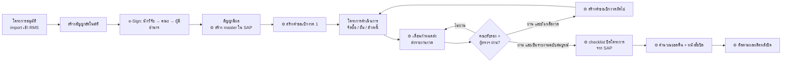
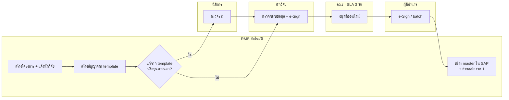
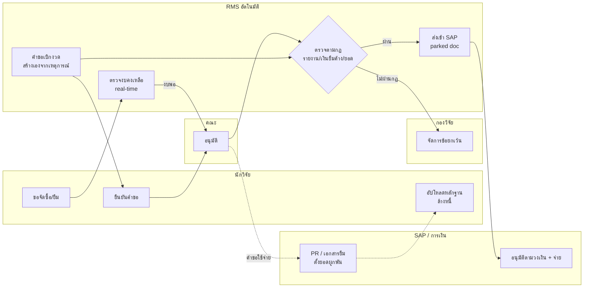

# 02 — วิเคราะห์และปรับกระบวนการ (To-be)

> **Input:** [01-as-is-process.md](01-as-is-process.md)
> **ข้อเท็จจริงที่ยืนยันแล้ว:**
> - ทุกเรื่องต้องผ่านคณะ/ต้นสังกัด
> - ระบบต้องครอบคลุมการใช้จ่ายภายในโครงการ
> - ระบบการเงินคือ SAP ECC 6.0 ซึ่งกำลังย้ายไป S/4HANA
> - แหล่งทุนภายนอกยังระบุไม่ได้

## หลักการออกแบบ

1. **บันทึกครั้งเดียว ใช้ได้ทุกที่ (Single source of truth):** ข้อมูลโครงการ สัญญา และงวดเงินอยู่ใน RMS ส่วนตัวเลขบัญชีจริงอยู่ใน SAP ไม่มี Excel คู่ขนาน
2. **ไม่ตัดขั้นตอนที่ระเบียบบังคับ แต่ทำให้เร็วขึ้น:** ขั้นที่ต้องผ่านคณะยังอยู่ครบ แต่เปลี่ยนเป็นการอนุมัติออนไลน์ มี SLA และส่งเรื่องขึ้นไปอัตโนมัติเมื่อเกินเวลา
3. **ให้ระบบตรวจแทนคน:** เงื่อนไขที่เขียนเป็นกฎได้ (เช่น รายงานครบ งบพอ ยอดตรงงวด) ให้ระบบตรวจ คนตรวจเฉพาะกรณียกเว้น
4. **เหตุการณ์หนึ่งพาไปสู่ขั้นถัดไปเอง:** เช่น รายงานความก้าวหน้าผ่าน → ระบบสร้างคำขอเบิกงวดถัดไปให้อัตโนมัติ
5. **ทุกคนเห็นสถานะเดียวกัน:** ทุกเรื่องมีสถานะ ผู้ถือเรื่อง และอายุงาน (aging) ที่นักวิจัยดูได้เอง

## สัญลักษณ์ผลการวิเคราะห์

| ผล | ความหมาย |
|---|---|
| ❌ **ตัดทิ้ง** | ไม่จำเป็นอีกต่อไปเมื่อมีระบบกลาง |
| ⚙️ **อัตโนมัติ** | ระบบทำแทนคน |
| 🔗 **รวม** | ยุบรวมกับขั้นตอนอื่นให้เป็นการกระทำเดียว |
| ✅ **คงไว้ (ดิจิทัล)** | ยังต้องมีคนทำ แต่ทำผ่านระบบ |
| 📜 | ต้องออกประกาศ/คำสั่ง/ระเบียบรองรับก่อนใช้งานจริง (ดูหัวข้อ "สิ่งที่ต้องแก้ระเบียบ") |

---

## ตารางวิเคราะห์ทุกขั้นตอน

### ช่วงที่ 1: การทำสัญญา

| # | ขั้นตอนเดิม | ผล | To-be และเหตุผล |
|---|---|---|---|
| 1.1 | แจ้งผลอนุมัติทุน | ⚙️ | รับข้อมูลโครงการที่อนุมัติแล้วเข้า RMS (import/API) แล้วระบบแจ้งนักวิจัยอัตโนมัติ |
| 1.2 | ปรับแก้ข้อเสนอและงบ | ✅ | ทำเฉพาะทุนที่มีเงื่อนไขให้แก้ แก้ในฟอร์มของระบบ มี version และ comment ในที่เดียว แก้ปัญหา P1 |
| 1.3 | ร่างสัญญาจาก Word | ⚙️ | ระบบ generate สัญญาจาก template ตามประเภททุน เติมข้อมูลโครงการ งบ และงวดให้ แก้ปัญหา P2 |
| 1.4 | นิติการตรวจร่าง | ✅ | ระบบส่งให้นิติการ **เฉพาะ** สัญญาที่ถูกแก้จาก template มาตรฐาน หรือเป็นสัญญาทุนภายนอก |
| 1.5 | พิมพ์ ลงนาม ติดอากร | ✅📜 | นักวิจัยลงนามด้วย e-Signature และชำระอากรผ่าน e-Stamp Duty ของกรมสรรพากร (ดูหมายเหตุ 1) แก้ปัญหา P3 |
| 1.6 | ผ่านคณะ | 🔗 | **คงไว้ตามระเบียบ** แต่ระบบส่งต่อให้อัตโนมัติทันทีที่นักวิจัยลงนาม มี SLA และส่งเรื่องขึ้นไปเมื่อเกินเวลา แก้ปัญหา P4 |
| 1.7 | ผู้มีอำนาจลงนาม | ✅ | ลงนามด้วย e-Signature อนุมัติได้ทั้งบนมือถือและแบบหลายเรื่องพร้อมกัน (batch) แก้ปัญหา P5 |
| 1.8 | ส่งคู่ฉบับและสำเนาให้การเงิน | ❌ | ทุกฝ่ายเปิดสัญญาฉบับที่ลงนามแล้วในระบบได้ตามสิทธิ์ |
| 1.9 | ลงทะเบียนใน Excel | ❌⚙️ | RMS เป็นทะเบียนโครงการ และสร้าง master ใน SAP (WBS/Fund/Grant) ให้อัตโนมัติ แก้ปัญหา P6 |
| 1.10 | สัญญากับแหล่งทุนภายนอก | ✅ | บันทึกสัญญาและเงื่อนไขของแหล่งทุนลงระบบ (แนบไฟล์ได้ถ้าแหล่งทุนใช้แบบฟอร์มของตัวเอง) |

### ช่วงที่ 2A: การขอรับเงินงวด

| # | ขั้นตอนเดิม | ผล | To-be และเหตุผล |
|---|---|---|---|
| 2.1 | ทำบันทึกขอเบิกงวด | ⚙️ | **งวดแรก:** ระบบสร้างคำขอเองเมื่อสัญญามีผล **งวดถัดไป:** ระบบสร้างคำขอเองเมื่อรายงานของงวดก่อนผ่าน นักวิจัยแค่ยืนยัน |
| 2.2 | แนบเงื่อนไขงวด | ⚙️ | ระบบผูกรายงานที่ส่งแล้วให้ ไม่ต้องแนบซ้ำ แก้ปัญหา P7 |
| 2.3 | คณะลงนามผ่านเรื่อง | 🔗 | **คงไว้ตามระเบียบ** แต่ **รวม** กับการที่คณะรับรองรายงานความก้าวหน้า (3.x) เป็นการอนุมัติครั้งเดียว |
| 2.4 | กองวิจัยตรวจเงื่อนไขงวด | ⚙️ | ระบบตรวจตามกฎ (rule engine) เช่น รายงานผ่าน ไม่มีเงินยืมค้างเกินกำหนด ยอดตรงสัญญา คนตรวจเฉพาะข้อยกเว้น แก้ปัญหา P8 |
| 2.5 | ส่งการเงินตั้งเบิก | ⚙️ | ระบบส่งเอกสารเข้า SAP เป็น parked document พร้อมเอกสารประกอบ |
| 2.6 | ผู้มีอำนาจอนุมัติเบิก | ✅📜 | อนุมัติดิจิทัล แยกตามวงเงินตามคำสั่งมอบอำนาจ |
| 2.7 | โอนเงิน | ✅ | การเงินโพสต์และจ่ายใน SAP ตามเดิม แล้ว RMS ดึงสถานะกลับมา |
| 2.8 | แจ้งนักวิจัย | ⚙️ | ระบบแจ้งอัตโนมัติเมื่อ SAP จ่ายเงินแล้ว |

### ช่วงที่ 2B: การใช้จ่ายภายในโครงการ

| # | ขั้นตอนเดิม | ผล | To-be และเหตุผล |
|---|---|---|---|
| 2.9 | ขอจัดซื้อจัดจ้าง / ยืมเงิน | ✅⚙️ | ฟอร์มในระบบตรวจงบคงเหลือตามหมวดแบบ real-time ก่อนส่ง เมื่ออนุมัติแล้วส่งต่อ SAP เป็น PR หรือเอกสารยืมเงิน และตั้งยอดผูกพัน (commitment) ทันที |
| 2.10 | ส่งหลักฐานและล้างเงินยืม | ✅⚙️ | อัปโหลดหลักฐานในระบบ ระบบนับถอยหลังกำหนดล้างหนี้และเตือนล่วงหน้า แก้ปัญหา P9 |
| 2.11 | ขอปรับแผนงบระหว่างหมวด | ✅📜 | ฟอร์ม change request ส่งตามกฎ: **อยู่ในเกณฑ์** → ให้คณะและกองวิจัยอนุมัติจบ **เกินเกณฑ์หรือทุนภายนอก** → ส่งต่อผู้มีอำนาจหรือแหล่งทุน แก้ปัญหา P10 |
| 2.12 | สรุปยอดคงเหลือใน Excel ส่วนตัว | ❌ | Budget dashboard ต่อโครงการ แสดงงบ ยอดผูกพัน ยอดใช้จริงจาก SAP และยอดคงเหลือ แก้ปัญหา P6 |

### ช่วงที่ 3: การติดตามความก้าวหน้า

| # | ขั้นตอนเดิม | ผล | To-be และเหตุผล |
|---|---|---|---|
| 3.1 | ติดตามกำหนดส่งใน Excel | ⚙️ | ระบบรู้กำหนดส่งจากสัญญาและงวด แก้ปัญหา P11 |
| 3.2 | อีเมลเตือน | ⚙️ | เตือนอัตโนมัติก่อนกำหนด 30, 7 และ 1 วัน และเมื่อเลยกำหนด พร้อมสำเนาถึงผู้ประสานงานคณะ |
| 3.3 | ส่งรายงานความก้าวหน้าและรายงานการเงิน | ✅⚙️ | ส่งผ่านฟอร์มที่มีโครงสร้างตามแม่แบบของทุน ส่วนรายงานการเงิน **ระบบสร้างจากข้อมูล SAP ให้** แก้ปัญหา P12 |
| 3.4 | ตรวจความครบถ้วนและรูปแบบ | ❌⚙️ | ระบบ validate ตั้งแต่ตอนส่ง ส่งไม่ได้ถ้าข้อมูลไม่ครบ จึงไม่ต้องมีขั้นตรวจด้วยมือ |
| 3.5 | ส่งผู้ทรงคุณวุฒิประเมิน | ✅ | มี reviewer portal เฉพาะทุนที่กำหนด พร้อมกำหนดส่งและระบบเตือน แก้ปัญหา P13 |
| 3.6 | แก้ไขแล้วส่งใหม่ | ✅ | comment และ version อยู่ในระบบ แก้ปัญหา P1 |
| 3.7 | ส่งรายงานต่อให้แหล่งทุนภายนอก | ⚙️ | export ตามรูปแบบของแหล่งทุนแต่ละแห่ง (funder profile) และต่อ API ในอนาคต แก้ปัญหา P14 |
| 3.8 | ขอขยายเวลา / เปลี่ยนแปลงโครงการ | ✅📜 | ใช้ฟอร์ม change request เดียวกับ 2.11 ส่งต่อตามกฎ |
| 3.9 | บันทึกผลผลิต | ✅ | นักวิจัยบันทึกผลผลิตเป็นส่วนหนึ่งของรายงาน (โครงสร้างข้อมูลเดียวกันทั้งระบบ) ระยะต่อไปดึงจาก ORCID/Scopus แก้ปัญหา P15 |

### ช่วงที่ 4: การปิดโครงการ

| # | ขั้นตอนเดิม | ผล | To-be และเหตุผล |
|---|---|---|---|
| 4.1 | เตือนกำหนดสิ้นสุด | ⚙️ | เหมือน 3.2 |
| 4.2 | ส่งรายงานฉบับสมบูรณ์ | ✅📜 | ส่งไฟล์ดิจิทัลเท่านั้น เลิกส่งเล่มกระดาษหลายชุด |
| 4.3 | ผู้ทรงคุณวุฒิประเมินและแก้ไข | ✅ | เหมือน 3.5–3.6 |
| 4.4 | การเงินตรวจรายงานและหลักฐานคงค้าง | ⚙️✅ | ระบบดึงเงินยืมค้างและใบสำคัญค้างจาก SAP มาแสดงเป็น checklist การเงินกดยืนยันอย่างเดียว |
| 4.5 | คืนเงินเหลือจ่าย | ⚙️ | ระบบคำนวณยอดคืนตามกติกาของทุน แล้วออกใบแจ้งชำระหรือ QR โดยกระทบยอดกับ SAP |
| 4.6 | ขอเบิกงวดสุดท้าย | 🔗 | ระบบสร้างคำขอเองเมื่อรายงานฉบับสมบูรณ์ผ่าน (เหมือน 2.1) |
| 4.7 | ส่งรายงานปิดโครงการให้แหล่งทุน | ⚙️ | เหมือน 3.7 |
| 4.8 | ออกหนังสือปิดโครงการ | ⚙️ | ระบบ generate หนังสือ แล้วผู้มีอำนาจลงนามแบบ batch |
| 4.9 | จัดเก็บเอกสารเข้าแฟ้ม | ❌ | เอกสารทั้งหมดอยู่ในระบบอยู่แล้ว ส่ง metadata ไปคลังรายงานของสถาบันได้ แก้ปัญหา P16 |
| 4.10 | ติดตามผลผลิตหลังปิดโครงการ | ⚙️ | ระบบเตือนตามเงื่อนไขในสัญญา เช่น ตีพิมพ์ภายใน 12 เดือน แก้ปัญหา P17 |
| 4.11 | ติดตามนักวิจัยที่ค้างส่งงานหรือค้างคืนเงิน | ⚙️ | ระบบติดสถานะ "ค้างภาระ" ให้อัตโนมัติ และแสดงสถานะนี้ตอนนักวิจัยขอทุนรอบถัดไป |

---

## สรุปผลการปรับ

| ผล | จำนวน | ขั้นตอน |
|---|---|---|
| ❌ ตัดทิ้ง | 5 | 1.8, 1.9, 2.12, 3.4, 4.9 |
| ⚙️ อัตโนมัติ (ไม่มีคนทำ) | 17 | 1.1, 1.3, 2.1, 2.2, 2.4, 2.5, 2.8, 3.1, 3.2, 3.7, 4.1, 4.5, 4.7, 4.8, 4.10, 4.11 และ 4.4 (บางส่วน) |
| 🔗 รวมกับขั้นอื่น | 3 | 1.6, 2.3, 4.6 |
| ✅ คงไว้ (ดิจิทัล) | 17 | ขั้นที่ต้องใช้วิจารณญาณ ต้องลงนาม หรือระเบียบบังคับ |
| **รวม** | **42** | |

**ขั้นตอนที่ต้องมีคนทำลดลงจาก 42 เหลือประมาณ 17–20 ขั้น (ลดลงราว 55%)** และขั้นที่เหลือไม่ต้องเดินเอกสารหรือพิมพ์ข้อมูลซ้ำอีกแล้ว

### ระยะเวลาโดยประมาณ 🟡

> ตัวเลขด้านล่างเป็นค่าประมาณจากงานลักษณะเดียวกัน ควรเก็บ baseline จริงก่อนเริ่มใช้ระบบเพื่อวัดผล

| เรื่อง | As-is (ประมาณ) | To-be (เป้าหมาย) | ตัวขับหลัก |
|---|---|---|---|
| ทำสัญญาเสร็จ | 3–6 สัปดาห์ | 5–7 วันทำการ | ไม่ต้องร่างสัญญาเอง, e-Signature, SLA ที่คณะ |
| เบิกงวด (นับจากรายงานผ่าน) | 2–4 สัปดาห์ | 3–5 วันทำการ | สร้างคำขออัตโนมัติ, ระบบตรวจเงื่อนไข, ส่งเข้า SAP |
| ปรับแผนงบในเกณฑ์ | 1–3 สัปดาห์ | 1–2 วันทำการ | ส่งต่อตามกฎ ไม่ต้องถึงผู้บริหาร |
| ปิดโครงการ (นับจากส่งรายงานฉบับสมบูรณ์) | 1–3 เดือน | 2–3 สัปดาห์ | checklist จาก SAP, คำนวณยอดคืนให้ |
| ตอบคำถาม "เรื่องอยู่ไหน" | โทรถาม | 0 (นักวิจัยดูเอง) | status tracking |

---

## Diagram To-be

### ภาพรวม: เหตุการณ์ที่พาไปสู่ขั้นถัดไป

### ช่วงที่ 1: สัญญา

### ช่วงที่ 2: เบิกงวดและใช้จ่าย

---

## สิ่งที่ต้องแก้ระเบียบหรือออกประกาศ 📜

ขั้นตอนเหล่านี้ทำได้ทางเทคนิค แต่ต้องมีเอกสารทางการรองรับก่อนเปิดใช้จริง

| # | เรื่อง | สิ่งที่ต้องมี | ถ้ายังไม่มี |
|---|---|---|---|
| R1 | ยอมรับการลงนามอิเล็กทรอนิกส์ในสัญญาทุนและบันทึกอนุมัติ | ประกาศมหาวิทยาลัยตาม พ.ร.บ.ว่าด้วยธุรกรรมทางอิเล็กทรอนิกส์ พ.ศ. 2544 | ใช้การลงนามบนกระดาษ แล้วสแกนแนบเข้าระบบ (ยังได้ประโยชน์เรื่องติดตามสถานะ) |
| R2 | ชำระอากรแสตมป์แบบอิเล็กทรอนิกส์ | ลงทะเบียนใช้ e-Stamp Duty ของกรมสรรพากร | ติดอากรบนกระดาษตามเดิม |
| R3 | มอบอำนาจอนุมัติเบิกจ่ายตามวงเงิน | คำสั่งมอบอำนาจที่ระบุวงเงินแต่ละระดับ | ส่งทุกเรื่องถึงผู้มีอำนาจ แต่ใช้ batch approve ได้ |
| R4 | เกณฑ์ปรับแผนงบที่กองวิจัยอนุมัติจบได้ (เช่น โอนระหว่างหมวดไม่เกิน X%) | ประกาศหลักเกณฑ์ | ส่งทุกเรื่องถึงผู้มีอำนาจ |
| R5 | รับรายงานเป็นไฟล์ดิจิทัลเท่านั้น | ประกาศกองวิจัย | ส่งไฟล์ดิจิทัลเป็นหลัก แล้วพิมพ์เฉพาะที่จำเป็น |
| R6 | SLA ของการอนุมัติที่คณะ และการส่งเรื่องขึ้นไปเมื่อเกินเวลา | มติหรือแนวปฏิบัติร่วมกับคณะ | แค่แจ้งเตือน ไม่ส่งเรื่องขึ้นไป |

---

## ข้อควรระวังเรื่อง SAP ECC → S/4HANA

- **อย่าผูก RMS กับ ECC โดยตรง:** ให้ RMS เชื่อมผ่าน integration layer ที่มี interface กลางของ RMS เอง เมื่อย้ายไป S/4HANA จะเปลี่ยนแค่ adapter ไม่ต้องแก้ RMS (รายละเอียดในเอกสาร 04)
- **ตกลงโครงสร้าง master data ของโครงการให้ตรงกับแผน S/4HANA ตั้งแต่ต้น:** ต้องเลือกว่าจะใช้ WBS (PS), Fund/Grant (PSM-FM/GM) หรือ Internal Order เพื่อไม่ต้อง map ใหม่หลังอัปเกรด ควรคุยกับทีม S/4HANA ก่อนเริ่มพัฒนา
- **ลำดับการพัฒนาที่แนะนำ:** ส่วน workflow ที่ไม่พึ่ง SAP (สัญญา รายงาน ติดตามสถานะ) ขึ้นก่อน ส่วนที่ต่อ SAP เริ่มจากอ่านข้อมูลอย่างเดียว (actuals, payment status) แล้วค่อยเพิ่มการเขียนเข้า SAP (parked doc, PR, advance) ให้สอดคล้องกับ timeline ของ S/4HANA

---

## คำถามค้าง

1. **[A6]** ใน SAP ปัจจุบันโครงการวิจัยถูกแทนด้วยอะไร (WBS, Fund/Grant หรือ Internal Order) และแผน S/4HANA จะใช้อะไร
2. การจัดซื้อจัดจ้างของโครงการวิจัยใช้ MM ใน SAP, e-GP หรือระบบพัสดุแยก
3. timeline การ go-live ของ S/4HANA
4. **[A3], [A9]–[A11]** ยังรอยืนยัน (ใช้สมมติฐานเดิมไปก่อน)
5. ต้องการช่องทางแจ้งเตือนนอกจากอีเมลหรือไม่ เช่น LINE OA หรือ MS Teams
