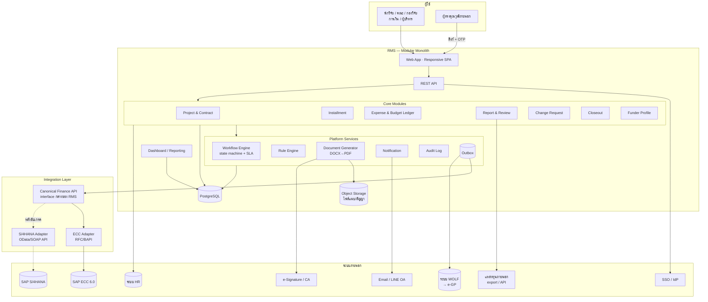
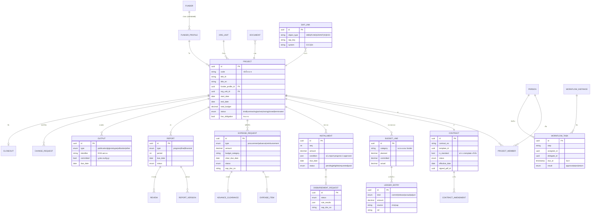
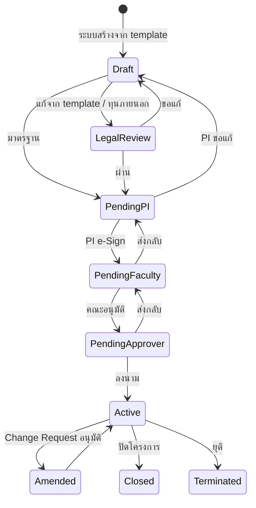
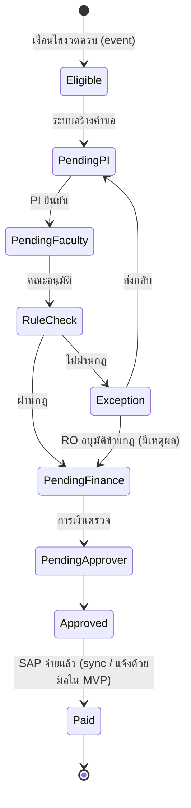
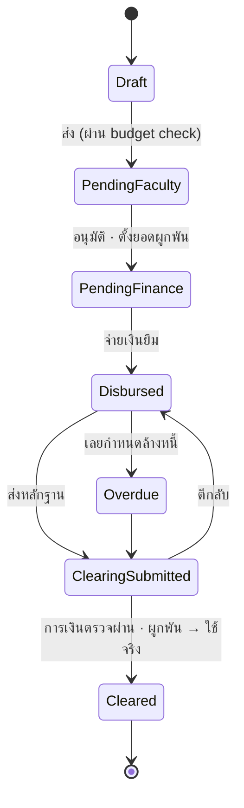
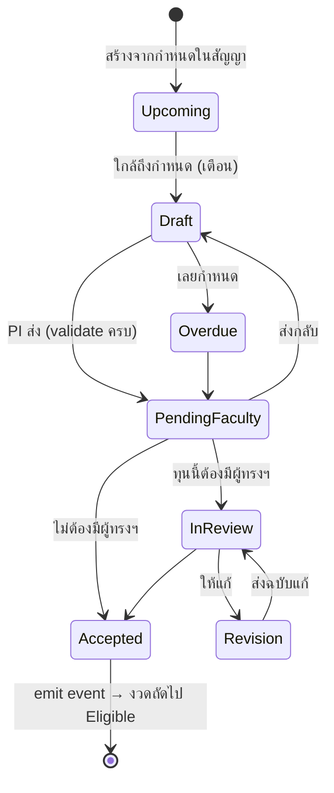
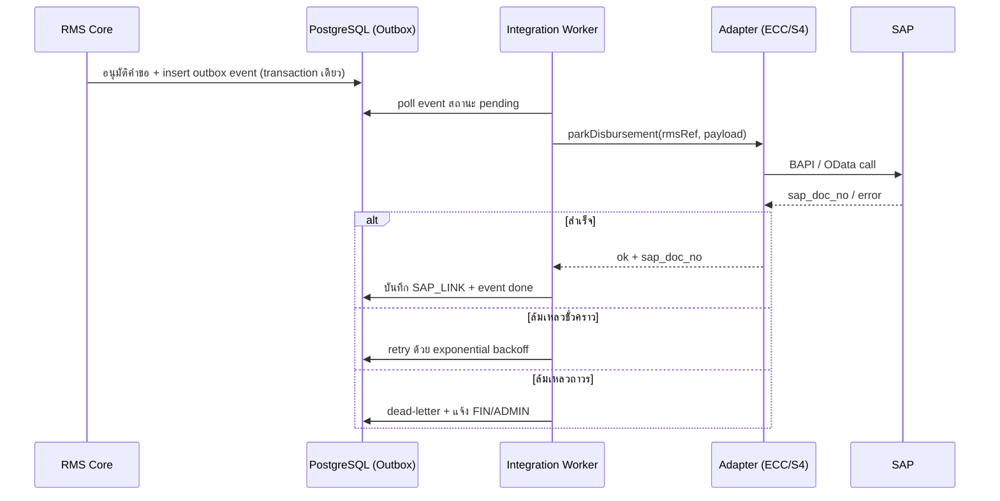
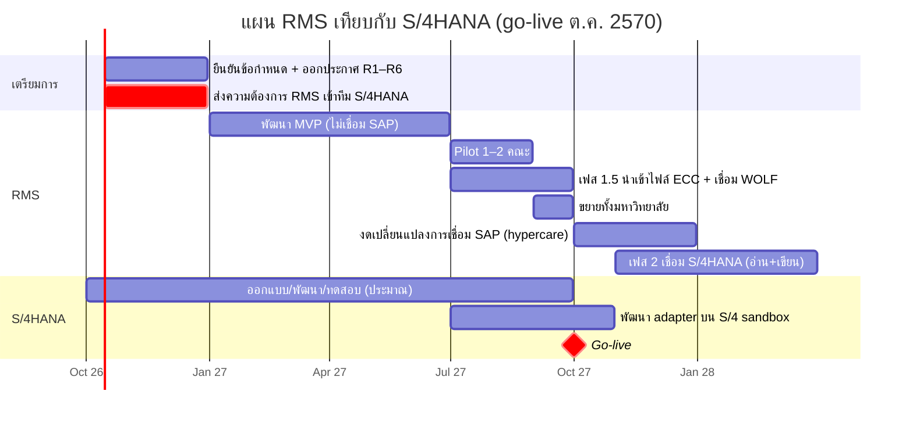

# 04 — สถาปัตยกรรมและเทคนิค

> **Input:** [03-requirements.md](03-requirements.md)
> **ข้อจำกัดหลัก:**
> - ทีม IT ขนาดเล็ก
> - SAP ECC 6.0 จะย้ายไป S/4HANA
> - แหล่งทุนภายนอกยังระบุไม่ได้
> - ทุกเรื่องต้องผ่านคณะ

## 1. ภาพรวมสถาปัตยกรรม

**รูปแบบที่แนะนำคือ Modular Monolith** คือแอปเดียว deploy ครั้งเดียว แต่แบ่งโมดูลภายในชัดเจน
เหตุผลคือทีมเล็กดูแลง่ายกว่า microservices มาก แต่ยังแยกบางโมดูลออกเป็น service ภายหลังได้
ส่วนที่แยกออกมาตั้งแต่แรกมีแค่ **Integration Layer** เพราะต้องเปลี่ยนตาม SAP

### หน้าที่ของแต่ละส่วน

| ส่วน | หน้าที่ | หมายเหตุ |
|---|---|---|
| Workflow Engine | ทุกเรื่องที่ต้องอนุมัติใช้ engine เดียว: กำหนดขั้น, ผู้ถือเรื่อง, SLA, ผู้ปฏิบัติแทน, ประวัติ | กำหนดเส้นทางด้วย config ในตาราง (ไม่ hard-code) เพื่อปรับตามระเบียบได้ |
| Rule Engine | ตรวจเงื่อนไขงวด, budget check, เส้นทางอนุมัติตามวงเงิน/ประเภท | กฎเก็บเป็น JSON (เช่น JSONLogic) ADMIN แก้ได้ |
| Funder Profile | เก็บกติกาของแต่ละแหล่งทุน: หมวดงบ, งวด, แบบฟอร์ม, คืนเงิน, export | รองรับแหล่งทุนที่ยังระบุไม่ได้ด้วยการเพิ่ม config ไม่ต้องแก้โค้ด |
| Budget Ledger | บัญชีย่อยต่อโครงการ ต่อหมวด: งบ / ผูกพัน / ใช้จริง | MVP: RMS เป็นผู้บันทึก · เฟส 1.5+: ยอดใช้จริงมาจาก SAP |
| Outbox | เก็บ event ที่จะส่งไป SAP ใน transaction เดียวกับข้อมูล แล้วค่อยส่งแบบ async + retry | กันข้อมูลหายหรือส่งซ้ำ |
| Integration Layer | แปลง canonical model ↔ SAP | แยก deploy ได้ เปลี่ยน adapter ตอนย้ายไป S/4HANA |

---

## 2. Data Model หลัก

**หลักการของ data model**
- `FUNDER_PROFILE` เก็บเป็น version: แก้กติกาแล้วไม่กระทบโครงการเดิมที่ผูกกับ version เก่า
- `LEDGER_ENTRY` เป็นแบบ append-only: ยอด `committed` / `actual` ใน `BUDGET_LINE` คำนวณจาก entry จึงตรวจสอบย้อนหลังได้
- `SAP_LINK` แยกออกมาเป็นตารางของตัวเอง: ตอนย้ายไป S/4HANA เพิ่ม record ใหม่ (`system=S4`) โดยไม่ต้องแก้ schema หลัก

---

## 3. State Machines

### สัญญา (Contract)

### คำขอเบิกงวด (Disbursement Request)

### ยืมเงิน → ล้างหนี้ (Advance)

> ช่วงที่อยู่ในสถานะ `Overdue` → โครงการติดธง `has_obligation` และ rule engine บล็อกการเบิกงวดถัดไป

### รายงาน (Report)

---

## 4. การเชื่อมต่อ SAP (ECC 6.0 → S/4HANA)

### 4.1 หลักการ

1. **RMS ไม่รู้จัก SAP โดยตรง:** core ของ RMS เรียกผ่าน **Canonical Finance API** ที่ RMS นิยามเอง ส่วน adapter แต่ละตัวแปลงเป็นภาษาของ SAP แต่ละรุ่น
2. **แบ่งเจ้าของข้อมูลชัดเจน:** RMS เป็นเจ้าของวงจรชีวิตโครงการ, สัญญา, workflow และเอกสาร ส่วน SAP เป็นเจ้าของการบันทึกบัญชี, การจ่ายเงิน และเงินยืม
3. **ทุก transaction มี idempotency key (เลขอ้างอิง RMS):** ส่งซ้ำแล้ว SAP ไม่บันทึกซ้ำ
4. **กระทบยอดรายวัน (reconciliation job):** เทียบยอดใน RMS กับ SAP แล้วแจ้งเตือนถ้าไม่ตรง

### 4.2 Canonical Finance API

| Operation | ทิศทาง | ใช้เมื่อ | เฟส |
|---|---|---|---|
| `getActuals(projectRef, period)` | SAP → RMS | sync ยอดใช้จริงต่อหมวด | 1.5 |
| `getPaymentStatus(rmsRef)` | SAP → RMS | สถานะการจ่ายงวด / เงินยืม | 1.5 |
| `getOpenItems(projectRef)` | SAP → RMS | เงินยืมและใบสำคัญค้าง สำหรับ checklist ปิดโครงการ | 1.5 |
| `createProjectMaster(project)` | RMS → SAP | สัญญามีผล | 2 |
| `parkDisbursement(request)` | RMS → SAP | คำขอเบิกงวดผ่านการอนุมัติ | 2 |
| `submitProcurement(req)` / `getProcurementStatus(ref)` | RMS ↔ **WOLF** | คำขอจัดซื้อผ่านการอนุมัติ → WOLF → e-GP แล้วรับสถานะ/ยอดจริงกลับ (ไม่ผ่าน SAP) | 1.5 |
| `createAdvance(req)` / `clearAdvance(req)` | RMS → SAP | ยืมเงิน / ล้างหนี้ | 2 |

### 4.3 Adapter: ECC vs S/4HANA 🟡

> ตารางนี้เป็นแนวทางเบื้องต้น ต้องยืนยันกับทีม SAP ของมหาวิทยาลัยว่าใช้ module ใดและมี middleware อะไรอยู่แล้ว

| ประเด็น | ECC 6.0 Adapter | S/4HANA Adapter |
|---|---|---|
| Protocol | RFC/BAPI (ผ่าน SAP JCo/NCo) หรือ SOAP ผ่าน SAP PI/PO | OData / SOAP APIs มาตรฐาน (ดูรายการใน SAP Business Accelerator Hub) ผ่าน SAP BTP Integration Suite หรือเรียกตรง |
| Master โครงการ | ✅ **Internal Order (IO)** | ยังไม่ตัดสินใจ (ดูหัวข้อ 4.5) |
| บันทึกเอกสารบัญชี | เช่น `BAPI_ACC_DOCUMENT_POST` / park ด้วย custom RFC | Journal Entry API |
| ใบขอซื้อ | ไม่ใช้ (จัดซื้อผ่าน WOLF → e-GP) | ไม่ใช้ เว้นแต่โครงการ S/4HANA จะย้ายจัดซื้อเข้า MM |
| ยอดใช้จริง | **ไฟล์ export รายงาน CO ตาม IO** (เช่น รายงาน actual/commitment ต่อ IO) นำเข้า RMS รายวัน/รายสัปดาห์ | CDS view / OData ของ Universal Journal (ACDOCA) |
| ความเสี่ยง | custom RFC ต้องทิ้งเมื่ออัปเกรด | API บางตัวต้องเปิดใช้งาน / ต้องมี BTP |

### 4.4 Pattern การส่งข้อมูล

### 4.5 โครงสร้างโครงการวิจัยใน S/4HANA: ข้อมูลประกอบการตัดสินใจ ⚠️ เร่งด่วน

ECC ปัจจุบันใช้ **Internal Order (IO)** และ S/4HANA ยังไม่ได้ตัดสินใจ
เรื่องนี้ต้องตัดสินในช่วงออกแบบ (blueprint) ของโครงการ S/4HANA ซึ่งน่าจะอยู่ในช่วงนี้ เพราะจะ go-live ต.ค. 2570
**ข้อเสนอ:** กองวิจัยส่งความต้องการด้านล่างเข้าทีม S/4HANA ภายใน **ธ.ค. 2569**

**สิ่งที่ RMS ต้องการจาก SAP** (ไม่ว่าจะเลือกตัวเลือกใด)
1. วัตถุ 1 ตัวต่อ 1 โครงการ (หรือ 1 สัญญา) ที่ RMS สร้างหรือขอสร้างผ่าน API ได้
2. ยอดใช้จริงและยอดผูกพันต่อโครงการ ที่แยกเป็นหมวดงบได้ (ผ่าน cost element / commitment item ที่ map กับหมวดของแหล่งทุน)
3. สถานะการจ่ายเงินงวดและเงินยืม อ้างอิงด้วยเลขเอกสารของ RMS
4. ปิดวัตถุได้เมื่อปิดโครงการ และกันไม่ให้มีการลงบัญชีหลังปิด

| ตัวเลือก | เหมาะเมื่อ | ข้อดี | ข้อควรพิจารณา |
|---|---|---|---|
| **A. คง Internal Order (CO)** | ต้องการย้ายระบบให้เสี่ยงน้อยที่สุด | migrate ตรงจาก ECC, ผู้ใช้คุ้นเคย, RMS map ง่าย | งบตามหมวดและการคุมงบ (availability control) ทำได้จำกัด รายงานตามแหล่งทุนต้องทำใน RMS หรือ BI |
| **B. WBS Element (PS)** | โครงการใหญ่ มีหลายระยะหรือหลายกิจกรรมย่อย | มีโครงสร้างหลายระดับ, คุมงบได้ดี, รองรับงบหลายปี | ตั้งค่าและดูแลมากกว่า IO ต้องฝึกผู้ใช้ |
| **C. Grants Management (PSM-GM) + FM** | มีทุนภายนอกจำนวนมาก ต้องการรายงานตามแหล่งทุน คุมงบตามหมวดของแหล่งทุน | ออกแบบมาเพื่อทุนโดยเฉพาะ (sponsor, sponsored class, งบตามเงื่อนไขแหล่งทุน) | ซับซ้อนที่สุด ใช้เวลาและงบ implement สูง อาจไม่ทัน ต.ค. 2570 |

**ความเห็นเบื้องต้น** 🟡 (ต้องให้ทีม S/4HANA และกองคลังประเมินร่วมกัน)
- ถ้าเวลาและงบของโครงการ S/4HANA จำกัด → **A (คง IO)** แล้วให้ RMS เป็นผู้คุมงบตามหมวดและทำรายงานตามแหล่งทุน
- ถ้าทุนภายนอกเป็นสัดส่วนใหญ่และต้องคุมงบใน SAP → พิจารณา **C** แต่อาจทำเป็นระยะที่ 2 หลัง go-live
- **RMS ออกแบบให้รองรับได้ทุกตัวเลือก:** ใช้ `SAP_LINK.object_type` และตาราง mapping หมวดงบ ↔ cost element ทำให้เปลี่ยนเฉพาะ adapter ไม่ต้องแก้ core

### 4.6 แผนเวลาเทียบกับการย้ายไป S/4HANA

| ช่วง | สิ่งที่ทำ | เหตุผล |
|---|---|---|
| ต.ค.–ธ.ค. 69 | ยืนยันข้อกำหนด ออกประกาศ และส่งความต้องการเข้าทีม S/4HANA | โครงสร้างโครงการใน S/4HANA กระทบ RMS เฟส 2 ทั้งหมด |
| ม.ค.–มิ.ย. 70 | พัฒนา MVP | ไม่พึ่ง SAP จึงไม่ต้องรอ S/4HANA |
| ก.ค.–ก.ย. 70 | Pilot และเฟส 1.5 | เชื่อม ECC แบบ **ไฟล์ export เท่านั้น** เพราะ ECC เหลืออายุอีกไม่กี่เดือน ส่วนการเชื่อม WOLF ไม่เกี่ยวกับ SAP จึงทำได้เลย |
| ก.ย. 70 | ขยายทั้งมหาวิทยาลัย | ทำให้เสร็จก่อน go-live ของ S/4HANA ถ้า pilot ไม่ทัน ให้เลื่อนไป ม.ค. 71 **ไม่ควรขยายช่วง ต.ค.–ธ.ค. 70** เพราะเจ้าหน้าที่การเงินจะยุ่งกับ S/4HANA และเป็นต้นปีงบประมาณ |
| ต.ค.–ธ.ค. 70 | hypercare ของ S/4HANA | RMS ใช้ได้ตามปกติ (การเงินบันทึก SAP ด้วยมือโดยอ้างเลข RMS) |
| พ.ย. 70–มี.ค. 71 | เฟส 2 เชื่อม S/4HANA | พัฒนา adapter บน sandbox ไว้ตั้งแต่ ก.ค. 70 แล้วเปิดใช้เมื่อ S/4HANA นิ่ง |

**ข้อมูลที่ต้องหาเพิ่ม:** WOLF มี API หรือไม่ และส่งข้อมูลจัดซื้อเข้า SAP อย่างไร
คำตอบนี้กำหนดว่ายอดผูกพันและยอดใช้จริงของการจัดซื้อจะดึงจาก WOLF หรือจาก SAP

---

## 5. ทางเลือก Tech Stack

| | **ทางเลือก A: TypeScript Full-stack** | **ทางเลือก B: .NET** |
|---|---|---|
| Frontend | React + Next.js, UI kit (เช่น MUI / shadcn) | React (หรือ Blazor ถ้าทีมไม่ถนัด JS) |
| Backend | NestJS (Node.js) | ASP.NET Core 8 |
| Database | PostgreSQL | PostgreSQL หรือ SQL Server (ถ้ามี license อยู่แล้ว) |
| ORM | Prisma / TypeORM | Entity Framework Core |
| Workflow | state machine ในตารางของ RMS เอง (ถ้าซับซ้อนใช้ Temporal) | state machine ในตารางของ RMS เอง (ถ้าซับซ้อนใช้ Elsa Workflows) |
| สร้างเอกสาร | docx-templates + LibreOffice headless (DOCX→PDF) | OpenXML SDK / DocX + LibreOffice headless |
| ต่อ SAP ECC | ผ่าน middleware (PI/PO, BTP) เป็นหลัก | **SAP NCo** (connector ทางการสำหรับ RFC) หรือผ่าน middleware |
| ข้อดี | ภาษาเดียวทั้ง frontend/backend, หาคนง่าย, ecosystem ใหญ่ | type-safe, เครื่องมือ enterprise ครบ, ต่อ RFC ตรงได้ด้วย connector ทางการ, เหมาะกับองค์กรที่ใช้ Microsoft |
| ข้อเสีย | ต่อ RFC ตรงทำได้ยากกว่า (ต้องพึ่ง middleware) | ถ้าใช้ SQL Server / Windows มีค่า license, คนที่ถนัด .NET + React อาจหายากกว่า |

**คำแนะนำ:** ให้เลือกตาม **ทักษะของทีม IT ที่มีอยู่** เป็นหลัก
- ถ้ามหาวิทยาลัยมี middleware ต่อ SAP อยู่แล้ว (PI/PO หรือ BTP) → **A** หรือ **B** ก็ได้
- ถ้าต้องต่อ ECC ตรงแบบ RFC → **B** เสี่ยงน้อยกว่า

**ทางเลือกที่ไม่แนะนำสำหรับเฟสนี้**
- **Microservices:** ทีมเล็กแบกภาระ operation ไม่ไหว
- **Low-code (เช่น Power Apps):** ทำ prototype ได้เร็ว แต่จะติดข้อจำกัดเรื่อง budget ledger, rule engine และการต่อ SAP

### Infrastructure

| ส่วน | แนะนำ |
|---|---|
| Deploy | Docker containers บน VM หรือ Kubernetes ของมหาวิทยาลัย (on-prem หรือ private cloud) |
| Object storage | MinIO (on-prem, S3-compatible) |
| Search | PostgreSQL full-text ก่อน แล้วค่อยใช้ OpenSearch เมื่อจำเป็น |
| Dashboard | หน้า dashboard ในตัว RMS สำหรับผู้ใช้ทั่วไป และ Metabase / Power BI ต่อ read replica สำหรับนักวิเคราะห์ |
| CI/CD | Git + pipeline (GitLab CI / GitHub Actions / Azure DevOps): test → scan → deploy staging → production |
| Monitoring | log กลาง, metrics และ alert เมื่อ integration ล้มเหลว |

---

## 6. Dashboard และรายงานผู้บริหาร

| กลุ่ม | ตัวชี้วัด | กรองตาม |
|---|---|---|
| ภาพรวมทุน | จำนวนโครงการ active, งบรวม, งบตามแหล่งทุน | ปีงบประมาณ, คณะ, แหล่งทุน, ประเภททุน |
| การเบิกจ่าย | % เบิกจ่ายเทียบแผน, ยอดผูกพัน, ยอดคงเหลือ, เงินยืมค้าง/เลยกำหนด | เดือน, คณะ |
| ความก้าวหน้า | โครงการตามสถานะ, รายงานค้างส่ง/เลยกำหนด, โครงการที่ขอขยายเวลา | คณะ, แหล่งทุน |
| ผลผลิต | ผลผลิตตามประเภท, ผลผลิตที่ผูกพันแต่ยังไม่ส่ง | ปี, คณะ |
| ประสิทธิภาพกระบวนการ | lead time เฉลี่ยต่อขั้น, % เรื่องที่อยู่ใน SLA, หน่วยงานที่ค้างมากที่สุด | ประเภทเรื่อง, หน่วยงาน |
| ความเสี่ยง | นักวิจัยค้างภาระ, โครงการใกล้หมดเวลาแต่ใช้งบน้อย | — |

---

## 7. ความปลอดภัยและ PDPA (สรุปเชิงเทคนิค)

- **Authentication:** SSO (OIDC/SAML) และ MFA สำหรับบทบาทการเงิน/ผู้อนุมัติ ส่วนผู้ทรงฯ ภายนอกใช้ magic link + OTP ที่มีวันหมดอายุ
- **Authorization:** RBAC + policy ตามหน่วยงานและโครงการ ตรวจซ้ำที่ API ทุกครั้ง (ไม่พึ่งการซ่อนปุ่มใน UI)
- **การปกป้องข้อมูล:** เข้ารหัสข้อมูลอ่อนไหว (เลขบัตรประชาชน, เลขบัญชีธนาคาร) ระดับ column และปิดบังบางส่วนเมื่อแสดงผล
- **ไฟล์แนบ:** สแกนไวรัส, จำกัดชนิดไฟล์, ดาวน์โหลดผ่าน signed URL ที่หมดอายุ
- **Audit log:** append-only แยกตาราง และสำรองแยกจากข้อมูลหลัก
- **PDPA:** ทำ data inventory และ retention policy ต่อประเภทข้อมูล ทำ privacy notice สำหรับผู้ทรงฯ ภายนอก และมีช่องทางรับคำขอใช้สิทธิของเจ้าของข้อมูล
